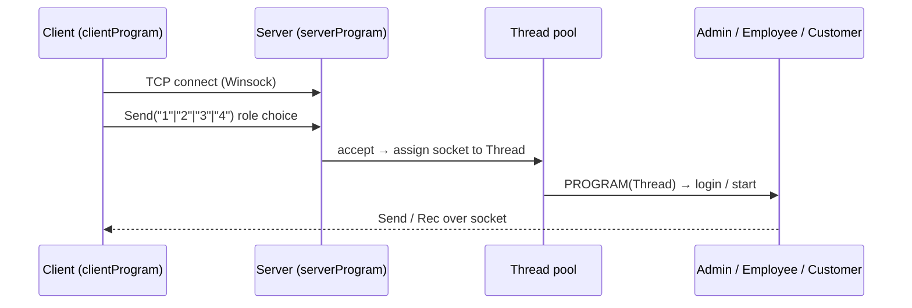

# Online Shopping System — Project Overview & Test Implementation Plan

This document describes what the project is, how it is built today, and a phased plan to add a `tests/` folder (`testClient` / `testServer`), run coverage locally, and integrate the same tests in Jenkins with `coverage.xml` output.

---

## 1. Project summary

| Item | Detail |
|------|--------|
| **Name** | Online Shopping System (MSM Grocery Center) |
| **Language** | C++ (console application) |
| **Platform** | **Windows only** — Winsock 2.2 (`ws2_32.lib`) and Win32 threads (`CreateThread`) |
| **Architecture** | Two executables: **Client** and **Server**, communicating over TCP (`127.0.0.1:7777` by default) |
| **Layers** | (1) **Networking** — `Client`, `Server`, `Thread` (2) **Management** — `Person`, `Customer`, `Employee`, `Admin`, `Goods`, `Cash`, complaints (server only) |
| **Build today** | No CMake/Makefile/Visual Studio solution in repo; sources are compiled as two programs by including `.cpp` files from umbrella headers |
| **Persistence** | Text files: `customer.txt`, `admin.txt`, `emp.txt`, `clients.txt`, complaint files, goods/inventory data (ignored by `.gitignore`) |

---

## 2. Repository layout

```
online-shopping-system/
├── Client/
│   ├── clientProgram.cpp      # Client main() — menu → Send(role) → Admin/Employee/Customer
│   ├── myHeader.h             # Includes all Client .cpp translation units
│   └── Headers/
│       ├── Client.h / Client.cpp
│       ├── Person.h / Person.cpp
│       ├── Customer.h / Customer.cpp
│       ├── Employee.h / Employee.cpp
│       ├── Admin.h / Admin.cpp
│       ├── Goods.h
│       └── Cash.h               # Header-only implementation
├── Server/
│   ├── serverProgram.cpp      # Server main() — Server(PROGRAM) → role dispatch
│   ├── myHeader.h
│   └── Headers/
│       ├── Server.h / Server.cpp
│       ├── Thread.h / Thread.cpp
│       ├── Person.h / Person.cpp   # Different API than Client Person
│       ├── Customer / Employee / Admin / Goods / Cash
│       ├── Complaint_Base, Complaint_C, Complaint_E
│       └── ...
├── README.md
└── .gitignore                   # *.txt, *.dat, *.exe
```

**Important:** Client and Server each have their own copy of management classes. They are **similar in name** but **not identical** (e.g. `Person` on Client uses `Client*` and local validation; on Server uses `Thread*` and file-based `string` fields).

---

## 3. How the system works

### 3.1 High-level flow



1. **Server** starts `Server::start()` → WSAStartup, thread pool, `bind`/`listen` on port 7777.
2. **Client** connects via `Client::start()` → `connect` to `127.0.0.1`.
3. User picks role on client; client sends an integer string (`1`–`4`).
4. Server `PROGRAM()` receives choice and constructs `Admin`, `Employee`, or `Customer` with the active `Thread`.
5. Business logic (login, buy, complaints, inventory) runs with **blocking console I/O** on client and **socket messaging** between sides.

### 3.2 Networking layer (reusable)

| Class | Role |
|-------|------|
| `Client` | `start()`, `Send(string/int/double)`, `Rec(string)` |
| `Server` | `start()`, `run()`, `select()` loop, thread pool, `updateActivity()` → `clients.txt` |
| `Thread` | Per-client worker; `Send`/`Rec` on accepted `SOCKET`; invokes user `FnPtr handler` |

Default endpoint: `127.0.0.1:7777` (see `Server.h`, `Client.h`).

### 3.3 Management layer (application)

| Feature | Where |
|---------|--------|
| Sign-up / login | `Person::login` (client UI + server file I/O) |
| Shopping cart / bill | `Person::buy` |
| Profile | `Person::profile` |
| Admin: employees, ban, inventory, cash | `Admin` (server); mirrored menus on client |
| Complaints | `Complaint_Base`, `Complaint_C`, `Complaint_E` (**Server only**) |
| Cash tracking | `Cash` (header-only; Client version does not update `finl` on `+`/`-` — Server version does) |

### 3.4 Current build pattern

Both sides use **include `.cpp` in headers** pattern:

- Client: `myHeader.h` → `#include "Headers/Client.cpp"` … `Admin.cpp`
- Server: `myHeader.h` → `#include "Headers/Server.cpp"` … `Complaint_E.cpp`

`clientProgram.cpp` / `serverProgram.cpp` are separate entry points that include `myHeader.h`.

**Implication for tests:** You cannot link “just one class” without either (a) keeping the same include pattern in test umbrellas, or (b) introducing a proper build (CMake) that compiles each `.cpp` once. **The plan below recommends (b) for coverage and Jenkins.**

---

## 4. Testability assessment

| Area | Testability | Notes |
|------|-------------|--------|
| `Cash` operators / `get_final_cash` | **High** | Small, no I/O; easy unit tests |
| `Person::check_*` validation (Client) | **High** | Pure logic if exposed or tested via thin wrappers |
| `Complaint_Base::write/see/update` | **Medium** | File I/O; use temp files in test fixtures |
| `Client` / `Server` / `Thread` | **Medium** | Need live sockets; integration tests on loopback |
| `login`, `buy`, `home` menus | **Low** | `cin`, `cout`, `getch()`, `system("cls")` — need refactoring or scripted I/O to unit test |
| Full E2E shopping flow | **Medium** | Automate client+server processes or socket-level protocol tests |

**Recommendation:** Phase 1 tests focus on **network smoke tests** + **Cash/validation/complaint file logic**; Phase 2 adds **integration tests** for Send/Rec protocol; Phase 3 optionally refactors console code behind injectable I/O for deeper coverage.

---

## 5. Proposed `tests/` folder structure

Mirror the production modules: each production `.h`/`.cpp` pair gets a corresponding **test** source under `testClient` or `testServer`.

```
online-shopping-system/
└── tests/
    ├── CMakeLists.txt              # Builds all tests + links production sources
    ├── testClient/
    │   ├── testClientMain.cpp      # Google Test main (or shared gtest main)
    │   ├── test_myHeader.h         # Optional: groups test includes
    │   └── Headers/
    │       ├── test_Client.h
    │       ├── test_Client.cpp
    │       ├── test_Person.h
    │       ├── test_Person.cpp
    │       ├── test_Customer.h
    │       ├── test_Customer.cpp
    │       ├── test_Employee.h
    │       ├── test_Employee.cpp
    │       ├── test_Admin.h
    │       ├── test_Admin.cpp
    │       └── test_Cash.h
    │       └── test_Cash.cpp
    └── testServer/
        ├── testServerMain.cpp
        ├── test_myHeader.h
        └── Headers/
            ├── test_Server.h / test_Server.cpp
            ├── test_Thread.h / test_Thread.cpp
            ├── test_Person.h / test_Person.cpp
            ├── test_Customer.h / test_Customer.cpp
            ├── test_Employee.h / test_Employee.cpp
            ├── test_Admin.h / test_Admin.cpp
            ├── test_Goods.h / test_Goods.cpp      # if logic added / testable helpers
            ├── test_Cash.h / test_Cash.cpp
            ├── test_Complaint_Base.h / test_Complaint_Base.cpp
            ├── test_Complaint_E.h / test_Complaint_E.cpp
            └── test_Complaint_C.h / test_Complaint_C.cpp  # header-only on server → tests via Base
```

### 5.1 Naming convention

| Production | Test file |
|------------|-----------|
| `Client/Headers/Client.cpp` | `tests/testClient/Headers/test_Client.cpp` |
| `Server/Headers/Server.cpp` | `tests/testServer/Headers/test_Server.cpp` |

Test headers (`test_*.h`) hold fixtures, mocks, and shared helpers (temp directories, socket ports, sample account files).

### 5.2 Test executables

| Executable | Sources | Purpose |
|------------|---------|---------|
| `testClient.exe` | `tests/testClient/**` + Client production sources (excluding `clientProgram.cpp`) | Client-side unit & integration tests |
| `testServer.exe` | `tests/testServer/**` + Server production sources (excluding `serverProgram.cpp`) | Server-side unit & integration tests |

Optional third target `testIntegration.exe` that starts server in a thread and drives `Client` — useful for protocol tests only.

### 5.3 Mapping: what each test module covers

#### testClient

| Test module | Production reference | Planned test cases (Phase 1) |
|-------------|---------------------|------------------------------|
| `test_Cash` | `Client/Headers/Cash.h` | `operator+`, `operator-`, `get_final_cash` |
| `test_Client` | `Client/Headers/Client.*` | `start()` fails gracefully if server down; with server up, `Send`/`Rec` round-trip |
| `test_Person` | `Client/Headers/Person.*` | `check_name`, `check_age`, `check_CNIC`, `check_email`, `check_phone_num`, `check_password`, `consistency` |
| `test_Customer` | `Customer.*` | Stub `Client` mock; defer menu tests |
| `test_Employee` | `Employee.*` | Stub mock; login protocol smoke |
| `test_Admin` | `Admin.*` | Stub mock; defer UI-heavy paths |

#### testServer

| Test module | Production reference | Planned test cases (Phase 1) |
|-------------|---------------------|------------------------------|
| `test_Cash` | `Server/Headers/Cash.h` | Cash in/out updates `finl` (differs from client — document both behaviors) |
| `test_Server` | `Server/Headers/Server.*` | `start()` succeeds; `getActivity()` after mocked connection log |
| `test_Thread` | `Thread.*` | Handler invoked; `Send`/`Rec` with connected socket (integration) |
| `test_Person` | `Server/Headers/Person.*` | `transfer_to_file`, `initialize_balance` with temp files |
| `test_Complaint_Base` | `Complaint_Base.*` | `write`, `see`, `update` with temp complaint file |
| `test_Customer/Employee/Admin` | respective `*.cpp` | File-based login with fixture accounts |

### 5.4 Example test skeleton (reference only — not implemented yet)

```cpp
// tests/testClient/Headers/test_Cash.cpp
#include <gtest/gtest.h>
#include "../../../Client/Headers/Cash.h"

TEST(CashTest, CashInIncreasesBalance) {
    Cash c;
    c + 100.0;
    EXPECT_DOUBLE_EQ(100.0, c.get_final_cash()); // adjust expectation per Client Cash behavior
}
```

```cpp
// tests/testServer/Headers/test_Server.cpp
#include <gtest/gtest.h>
#include "../../../Server/Headers/Server.h"

static void noopWorker(Thread&) {}

TEST(ServerTest, StartInitializesWinsock) {
    Server server(noopWorker, 17777); // non-default port to avoid clash
    EXPECT_TRUE(server.start());
}
```

---

## 6. Build & dependency plan (required for coverage)

Today there is no build file. To run tests and coverage reliably (local + Jenkins), add:

| Component | Choice | Reason |
|-----------|--------|--------|
| Build system | **CMake** (minimum 3.16) | Cross-target test executables, flags for coverage |
| Test framework | **Google Test** (via `FetchContent` or submodule) | Standard C++, good Jenkins integration |
| Compiler (local/Jenkins) | **MSVC** on Windows agent OR **MinGW-w64** | Project is Winsock-based; MSVC matches original; MinGW enables `gcov` + `gcovr` easily |
| Coverage (MSVC path) | **OpenCppCoverage** → Cobertura XML | Native on Windows without gcc |
| Coverage (MinGW path) | `-fprofile-arcs -ftest-coverage` + **gcovr** → `coverage.xml` | Single command Jenkins can archive |

### 6.1 CMake outline (to implement in Phase 2)

```text
add_subdirectory(tests)
# Production sources listed explicitly (avoid double-include of .cpp):
#   Client: Client.cpp, Person.cpp, ... (NOT clientProgram.cpp)
#   Server: Server.cpp, Thread.cpp, ... (NOT serverProgram.cpp)
# Link: ws2_32, gtest, gtest_main
```

### 6.2 Refactor note (minimal, for linkable tests)

To compile production code **once** in tests:

1. Stop including `.cpp` from `myHeader.h` in test builds **or** split into:
   - `myHeader.h` — declarations only
   - one `.cpp` per class (already exist under `Headers/`)
2. `clientProgram.cpp` / `serverProgram.cpp` link the object files instead of including all `.cpp`.

This is a **small, mechanical change** but important for correct coverage percentages. Can be done in the same PR as `tests/` or immediately before.

---

## 7. Local workflow — run tests & generate coverage

### 7.1 Prerequisites (Windows)

- Visual Studio Build Tools **or** MinGW-w64
- CMake ≥ 3.16
- Git
- **Option A:** OpenCppCoverage (MSVC)
- **Option B:** gcovr (`pip install gcovr`) with MinGW coverage flags

### 7.2 Steps (MinGW + gcovr — recommended for `coverage.xml`)

```powershell
cd online-shopping-system
cmake -B build -G "MinGW Makefiles" -DCMAKE_BUILD_TYPE=Debug -DENABLE_COVERAGE=ON
cmake --build build
ctest --test-dir build --output-on-failure

# Generate coverage.xml at repo root (or build/coverage.xml)
gcovr -r . --object-directory build --xml -o coverage.xml
```

### 7.3 Steps (MSVC + OpenCppCoverage)

```powershell
cmake -B build -G "Visual Studio 17 2022" -A x64
cmake --build build --config Debug
ctest -C Debug --test-dir build --output-on-failure

OpenCppCoverage --export_type cobertura:coverage.xml -- build\Debug\testClient.exe
# Run testServer similarly; merge XML if needed
```

### 7.4 What to verify locally before Jenkins

- [ ] `testClient.exe` and `testServer.exe` exit 0
- [ ] `coverage.xml` is valid Cobertura (Jenkins Cobertura plugin can parse it)
- [ ] No port conflicts (use configurable test port, e.g. `17777`)
- [ ] Tests use temp dirs for `*.txt` / complaint files (do not rely on `.gitignore` production data)

---

## 8. Jenkins integration plan

### 8.1 Agent requirements

| Requirement | Detail |
|-------------|--------|
| OS | **Windows** label (Winsock + threads) |
| Tools | CMake, compiler, Python (for gcovr) or OpenCppCoverage |
| Plugins | JUnit (optional), **Cobertura** (for `coverage.xml`) |

### 8.2 Pipeline stages (declarative `Jenkinsfile` — to add in repo later)

```text
1. Checkout SCM
2. CMake configure (Debug + ENABLE_COVERAGE=ON)
3. Build
4. Test (ctest → JUnit export if gtest junit listener added)
5. Coverage
   - gcovr → coverage.xml   OR
   - OpenCppCoverage → merge to coverage.xml
6. Archive artifacts: coverage.xml, test logs
7. Publish Cobertura Report (coverage.xml)
```

### 8.3 Example Jenkinsfile sketch

```groovy
pipeline {
    agent { label 'windows' }
    stages {
        stage('Build') {
            steps {
                bat '''
                    cmake -B build -G "MinGW Makefiles" -DENABLE_COVERAGE=ON
                    cmake --build build
                '''
            }
        }
        stage('Test') {
            steps {
                bat 'ctest --test-dir build --output-on-failure'
            }
        }
        stage('Coverage') {
            steps {
                bat 'gcovr -r . --object-directory build --xml -o coverage.xml'
            }
        }
    }
    post {
        always {
            archiveArtifacts artifacts: 'coverage.xml', allowEmptyArchive: false
            publishCoverage adapters: [coberturaAdapter('coverage.xml')]
        }
    }
}
```

Adjust `publishCoverage` to match your Jenkins version (Cobertura Plugin vs Coverage API plugin).

### 8.4 Repository files to add (after you approve this plan)

| File | Purpose |
|------|---------|
| `tests/CMakeLists.txt` | Test targets |
| `CMakeLists.txt` (root) | Project + coverage flags |
| `Jenkinsfile` | CI pipeline |
| `.gitignore` update | `build/`, `coverage.xml`, `*.gcda`, `*.gcno` |

---

## 9. Implementation phases (execution order)

| Phase | Deliverable | Owner action |
|-------|-------------|--------------|
| **0 — Review** | This document approved | You review and confirm framework (GTest) and compiler (MSVC vs MinGW) |
| **1 — Scaffold** | `tests/testClient`, `tests/testServer` folders + CMake + 2–3 smoke tests per side | Agent implements |
| **2 — Unit tests** | `test_Cash`, `test_Person` validation, `test_Complaint_Base` | Agent implements |
| **3 — Integration** | Server thread + Client `Send`/`Rec` on ephemeral port | Agent implements |
| **4 — Local coverage** | Documented commands; `coverage.xml` generated on your machine | You run; agent fixes gaps |
| **5 — Jenkins** | `Jenkinsfile`, Cobertura publish, Windows agent | You configure agent; agent adds pipeline |
| **6 — Optional refactor** | Decouple `cin`/`cout` for higher coverage of menus | Future enhancement |

**Estimated file count (Phase 1–3):** ~24 test source files + 3 CMake files + 1 Jenkinsfile.

---

## 10. Risks and mitigations

| Risk | Mitigation |
|------|------------|
| Duplicate `.cpp` includes cause link errors | Explicit CMake source list; do not include `myHeader.h` in tests |
| Tests hang on `recv` | Timeouts, non-blocking sockets in tests, or dedicated test handler that closes quickly |
| Port 7777 in use | `TEST_PORT` env var / CMake definition |
| Low coverage % due to console code | Report Cobertura anyway; prioritize testable modules first |
| Client vs Server `Cash` behavior mismatch | Separate `test_Cash` per module with documented expectations |
| Jenkins on Linux only | **Will not work** for this project without a Windows agent |

---

## 11. Decisions needed from you before implementation

Please confirm:

1. **Test framework:** Google Test (recommended) or another?
2. **Compiler on local machine:** MSVC (Visual Studio) or MinGW?
3. **Coverage tool:** OpenCppCoverage (MSVC) or gcovr (MinGW)?
4. **Scope of Phase 1:** Only `testClient` + `testServer` unit tests, or also a combined integration executable?
5. **CMake refactor:** OK to add root `CMakeLists.txt` and stop including `.cpp` in `myHeader.h` for test builds?

Once confirmed, implementation can proceed file-by-file following Section 5.

---

## 12. Quick reference — production entry points

| Program | Main file | Umbrella header |
|---------|-----------|-----------------|
| Client app | `Client/clientProgram.cpp` | `Client/myHeader.h` |
| Server app | `Server/serverProgram.cpp` | `Server/myHeader.h` |

| Protocol | Client sends | Server handles |
|----------|--------------|----------------|
| Admin | `"1"` | `Admin::login(adminFile)` |
| Employee | `"2"` | `Employee::login(empFile)` |
| Customer | `"3"` | `Customer::start()` |
| Exit | `"4"` | ends `PROGRAM` loop |

---

*Document version: 1.0 — planning only; test sources not yet created.*
